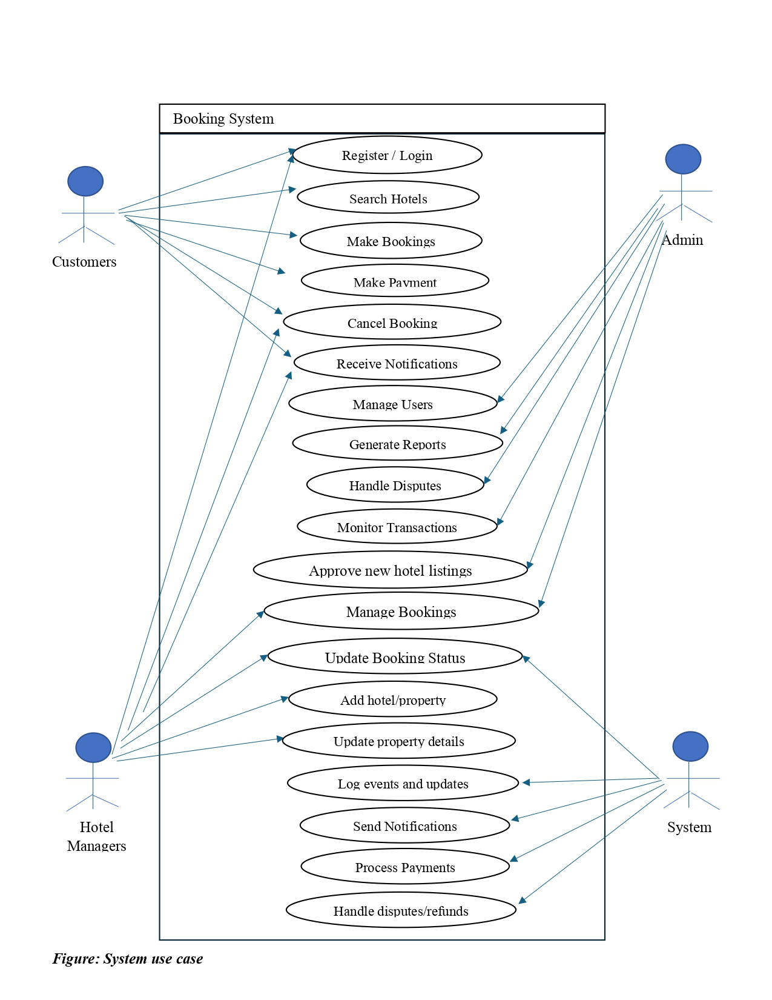

# Requirement Analysis in Software Development

This repository explores the process of requirement analysis in software development.

The goal is to understand how to effectively gather, document, and manage software requirements for successful project outcomes. It will cover different techniques, tools, and best practices used by developers and analysts during the planning phase of software projects.

## What is Requirement Analysis?

Requirement analysis is a critical phase in the Software Development Life Cycle (SDLC) where the needs and expectations of stakeholders are gathered, analyzed, and documented. It involves understanding what the users need from the software, ensuring the system will meet those needs, and identifying the constraints that may affect the solution.

**Importance of Requirement Analysis**:
- **Clarifies Project Scope**: Requirement analysis helps define the boundaries of a project, reducing scope creep and ensuring that development efforts align with business goals.
- **Improves Communication**: By gathering input from stakeholders and team members, requirement analysis ensures that everyone involved has a shared understanding of the project.
- **Reduces Risks**: Proper analysis helps identify potential issues early on, reducing the likelihood of costly mistakes during development and after deployment.
- **Improves Quality**: With well-defined requirements, developers can build software that meets user expectations, improving overall quality and customer satisfaction.
- **Supports Validation**: Requirement analysis provides a foundation for validating the software against the initial needs, ensuring the final product is fit for purpose.

## Why is Requirement Analysis Important?

Requirement analysis plays a pivotal role in the success of a software project. Here are three key reasons why it's critical in the SDLC:

1. **Prevents Scope Creep**:
   Properly conducted requirement analysis helps define the scope of the project and prevents unnecessary additions or modifications to the project during development. By clearly outlining what is expected from the software, it helps avoid scope creep, which can lead to delays and budget overruns.

2. **Enhances Communication and Collaboration**:
   Requirement analysis involves regular communication between stakeholders, business users, and the development team. This ensures that all parties have a clear understanding of what is needed and expected. Effective communication helps prevent misunderstandings and keeps everyone aligned throughout the development process.

3. **Saves Time and Money**:
   By identifying potential issues early in the project, requirement analysis allows for proactive problem-solving, saving time and money in the long run. Addressing ambiguities or challenges before development starts minimizes the need for rework, reducing both development time and the cost of fixing problems later in the SDLC.

## Key Activities in Requirement Analysis

The following are the key activities involved in requirement analysis that help ensure a successful software development project:

- **Requirement Gathering**:
   - The first step where all potential requirements are collected from stakeholders, including users, customers, and business leaders.
   - Involves interviews, surveys, questionnaires, and other data collection methods to understand what the stakeholders want from the system.

- **Requirement Elicitation**:
   - A more focused activity where requirements are extracted from the gathered data.
   - It involves discussions, workshops, and meetings with stakeholders to clarify and elaborate on their needs and expectations.
   - It’s also the phase where any hidden or implicit requirements are uncovered.

- **Requirement Documentation**:
   - The process of recording the requirements in a structured and detailed manner.
   - The documented requirements are typically written in a formal document known as a Software Requirements Specification (SRS), which provides a clear outline of what the software should achieve.
   - This documentation serves as the reference point for both developers and stakeholders throughout the project.

- **Requirement Analysis and Modeling**:
   - This involves analyzing the requirements for feasibility, completeness, and clarity.
   - It helps identify conflicts, dependencies, or missing information and enables the development of visual models, such as flowcharts, use case diagrams, or data models, to better understand system behavior and functionality.

- **Requirement Validation**:
   - The final step where the gathered and documented requirements are verified against stakeholders’ expectations to ensure they are accurate, complete, and aligned with the project's goals.
   - This step helps to ensure that the software, when built, will meet the users' needs and is free from errors or ambiguities in the requirements.

### Types of Requirements

#### Functional Requirements

Functional requirements describe the specific functionality the system must perform. These are the core features that the software should have to fulfill the business needs.
- **Hotel Listing**: The system must allow hotel managers to add, update, and delete their hotel listings, including hotel name, location, amenities, pricing, and availability.
- **Hotel Search**: The system must allow customers to search for hotels based on various filters such as location, price range, amenities, and availability.
- **Booking**: The system must allow users to book hotels by selecting their preferred check-in and check-out dates, entering personal details, and confirming the reservation.
- **Payment Integration**: The system must integrate with a third-party payment gateway to securely process payments for bookings.
- **Booking Confirmation**: Once a user successfully books a hotel, the system should send both the customer and hotel manager a booking confirmation notification.
- **Hotel Availability Management**: The system should allow hotel managers to manage the availability of rooms, including setting dates for booking unavailability.
- **Customer and Manager Profile Management**: Customers and hotel managers must be able to create, update, and manage their profiles.

#### Non-functional Requirements

Non-functional requirements specify the system's quality attributes, such as performance, security, scalability, and usability. These define how the system will perform under different conditions.
- **Performance**: The system should support at least 1000 concurrent users, ensuring smooth performance during peak usage times like holidays or weekends.
- **Scalability**: The system should be scalable to handle increased traffic, especially when the number of hotels, users, and transactions increases over time.
- **Availability**: The system should have an uptime of 99.9%, ensuring minimal downtime for both customers and hotel managers.
- **Security**: All sensitive data, including payment details and personal information, must be encrypted and securely stored to prevent unauthorized access or data breaches.
- **Usability**: The user interface should be intuitive and user-friendly, allowing customers to search for and book hotels with ease, while hotel managers can efficiently manage their listings and bookings.
- **Reliability**: The system should be reliable, ensuring that bookings, payments, and notifications are processed without failure.
- **Data Integrity**: The system must ensure the accuracy and consistency of hotel availability and booking data across different platforms and user sessions.
- **Load Balancing**: The system should be capable of handling high traffic loads through proper load balancing to ensure fair distribution of requests across servers.

### Use Case Diagrams

Use Case Diagrams are a type of behavioral diagram defined by UML (Unified Modeling Language) that visually represent the interactions between users (actors) and the system. They help identify the functional requirements of a system from the user's perspective and illustrate how the system responds to different inputs or requests.

#### Benefits of Use Case Diagrams:
- **Clarify system functionality**: They provide a clear visual summary of what the system does and how users interact with it.
- **Identify actors and goals**: They help define different user roles (like customers and hotel managers) and their objectives.
- **Support communication**: They serve as a communication tool between stakeholders, including developers, business analysts, and clients.
- **Aid in requirement gathering**: They ensure that all required functionalities are captured during the requirement analysis phase.
- **Provide a foundation for test cases**: Each use case can be expanded into a test scenario, supporting verification and validation.

Below is an example use case diagram for booking system, illustrating the interactions between users (actors) and the system functionalities.

## Acceptance Criteria

Acceptance Criteria are predefined standards or conditions that a software product or feature must meet to be accepted by the client, user, or stakeholders. They serve as a clear, measurable definition of "done" for user stories or features and ensure that developers, testers, and business stakeholders share a common understanding of the expected functionality.

### Importance of Acceptance Criteria

- ✅ **Clarity and Alignment**: Ensures that both the development team and stakeholders agree on what needs to be built.
- ✅ **Testability**: Facilitates the creation of test cases and quality assurance processes.
- ✅ **Scope Control**: Helps prevent scope creep by clearly defining what is included in a feature.
- ✅ **Improved Planning**: Enhances sprint planning by breaking down features into smaller, achievable goals.

### Example: Checkout Feature in Booking Management System

**User Story**: As a customer, I want to checkout after selecting a hotel and confirming my details so that I can complete my booking and make a payment.

**Acceptance Criteria**:
- [ ] The system displays a summary of the selected booking with check-in and check-out dates, room details, and pricing.
- [ ] The user can enter or select saved billing information.
- [ ] The user can choose from supported payment methods (e.g., credit card, mobile money).
- [ ] The system must validate all fields before processing the payment.
- [ ] Upon successful payment, a booking confirmation page is shown.
- [ ] A confirmation email and SMS are sent to the user.

